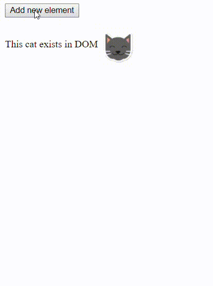

# Breaking out of the Matrix with React Portals and Mutation Observer

This is the example app for the [article on Medium](https://medium.com/@viacheslavlushchinskiy/breaking-out-of-the-matrix-with-react-portals-and-mutation-observer-b35b8d977235).

The app demonstrates the use of JavaScript Mutation Observer and React Portals that allows to easily modify any part of
the external parent app that hosts a React app.

When you click a button you add a new node to the external parent app. React app sees this new node and add a cat icon next to it. 

## Motivation
It is not a big deal nowadays to build a SPA if you fully control all the parts of it. It is usually much harder to integrate some parts
of your JavaScript code into existing app. With React Portals and Mutation Observer it becomes as easy as building your own app.

## installation
* In local project directory run `yarn` to load modules.
* Run `yarn start` to start the app.